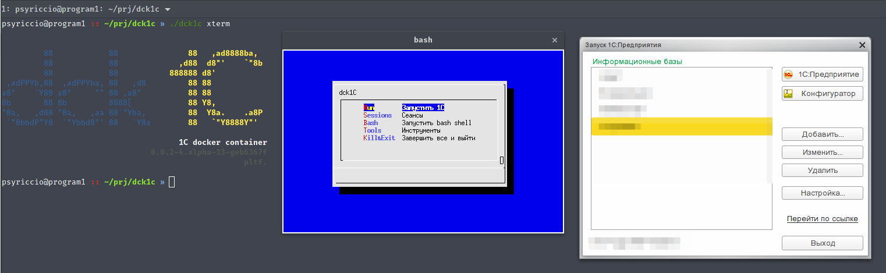
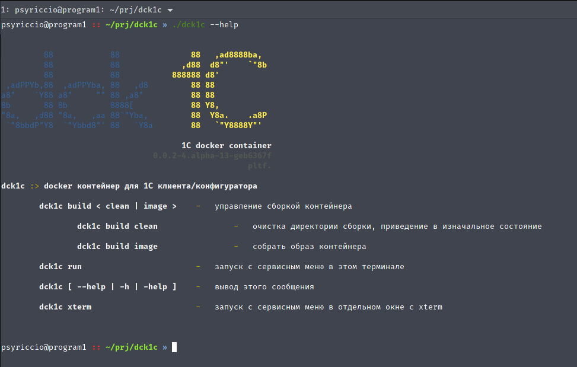
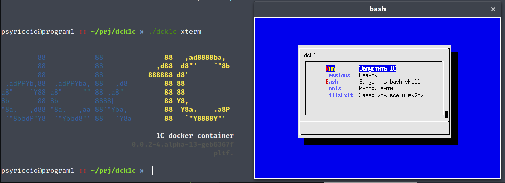
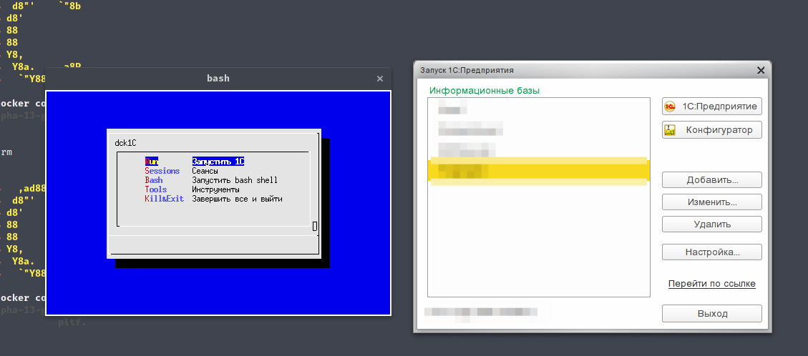
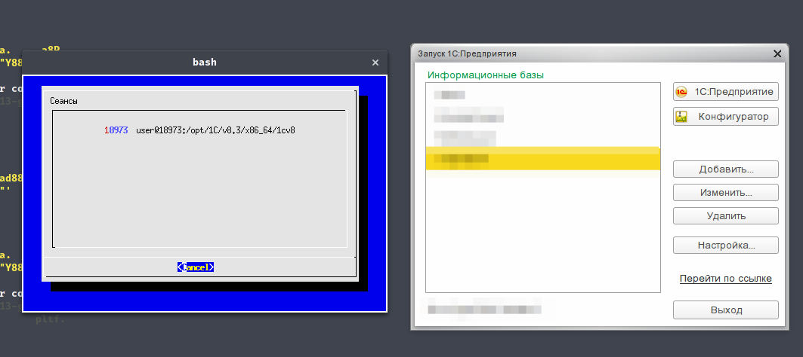
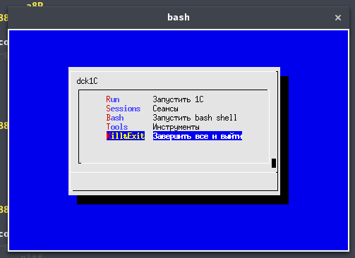

# dck1c менеджер контейнеров для 1C Enterprise клиента/конфигуратора



* [Описание](#Описание)
* [Установка](./#Установка)
* [Настройка](./#Настройка)
* [Сборка контейнера](./#Сборка-контейнера)

## Описание

Позволяет создавать, запускать и управлять docker-контейнерами на базе ubuntu 14.04,
для искользования 1C клиента/конфигуратора на любом Linux дистрибутиве, централизованного
управления версиями платформ, организации репозитория для быстрой установки на большое число
компьютеров, создания пакетов для установки 1С клиента на различные linux дистрибутивы, изоляции 1C от отстальной системы, запуска автоматизированных сервисов,
работающих с 1C, сборки/разборки конфигураций, построения build-серверов или систем
непрерывной интеграции для платформы 1С Enterprise.

## Установка

### Из git-репозитория

* Из домашней директории пользователя (или из другого места, если понимаете, что делаете), выполните:

`git clone https://github.com/psyriccio/dck1c.git --branch release`

либо скачайте архивом и распакуйте в домашнюю директорию (или другую директорию, куда желаете установить dck1c и на которую для вас установлены соответствующие права)

[dck1c-git-release.zip](https://github.com/psyriccio/dck1c/archive/release.zip)

* Для удобства использования добавьте пути к скриптам dck1c в PATH и установите в
переменной окружения DCK1C_ROOT путь к корневой директории dck1c
(при установке из домашней директории это `~/dck1c` или `/home/<имя пользователя>/dck1c`)
Это можно сделать отредактировав файл `dck1c/extra/dck1c-environment.sh`, исправив путь к dck1c и разместив его в директории `/etc/profile.d/` или создайте новый по следующему примеру:

`/etc/profile.d/dck1c-environment.sh:`
```
#!/usr/bin/env sh

export DCK1C_ROOT=~/dck1c # /opt/dck1c   - путь к корневой директории dck1c
export PATH=$DCK1C_ROOT:$DCK1C_ROOT/bin:$PATH
```

Готово! Теперь для использования dck1c, если переменные DCK1C_ROOT и PATH были установлены верно просто наберите в терминале dck1c, если переменные не были установлены запускайте dck1c перейдя в его директорию

```
cd ./some_where/dck1c
./dck1c
```

### Linux пакетом

Релизы dck1c так же доступны в виде пакетов для некоторых Linux-дистрибутивов
(пока доступен только Arch Linux)

[comming_soon_when_non_alpha_build_released](https://github.com/psyriccio/dck1c/projects)

### Установка debug/development версии
---

__Oсторожно!__

Development-версия может быть не стабильна, её использование может привести к потере данных и друним неприятным последствиям, используйте только если вы понимаете, что делаете!

---

`git clone https://github.com/psyriccio/dck1c.git --branch dev`

## Настройка

### config.sh

Основной конфигурационный файл (`config.sh`), содержаший настройки, влияющие на сборку и работу контейнеров находится в корневой директории dck1c, при сборке контейнера текущая
конфигурация копируется в контейнер.

* `DCK1C_DOCKER_REGISTRY='jws:5000'` - Хост или IP-адрес и порт используемого docker-репозитория


* `DCK1C_INJECT_NONFREE_FONTS=true` - Добавить шрифты mscorefonts
  > :warning: ___ВНИМАНИЕ!!!___ <br>
  Несвободный контент, читайте прилагаемую лицензию `mscorefonts.zip/mscorefonts_LICENSE`
 <br>Отключение может привести к нестабильной работе 1С


* `DCK1C_INJECT_FIRACODE_FONT=true` - Добавить `Fira Code` - свободный, моноширный шрифт для кода,
с поддержкой кирилицы и расширенным набором юникод-символов


* `DCK1C_AWESOME_FONTS_RENDERING=true` - Включить infinality патчи, исправляет рендеринг шрифтов,
если не жалко глаза, можно отключить
 > :warning: :no_entry: ___DEPRECATED!___ ___Не использовать!___.<br>
 В связи с выходом `freetype2` и повсеместным переходом на `wayland` infinality-патчи больше не требуются. Будет удалено в сл. версии.


* `DCK1C_INJECT_UI_THEMES=true` - Добавить тему оформления zookitwo + ultraflat icons set


* `DCK1C_AUTOSTART_CLIENT=true` - Запускать одного клиента при запуске контейнера


* `DCK1C_SQUASH_IMAGES=true` - Включает оптимизацию и объединение слоёв в образе после сборки
(уменьшает и оптимизирует образ). Если контейнер работает нестабильно -- можно попробовать выключить эту опцию


* `DCK1C_1CPLATFORM_ARCH='amd64'` - Архитектура платформы amd64 / i386


* `DCK1C_1CPLATFORM_VERSION='8.3.9-1850'` - Версия платформы для сборки


* `DCK1C_LANG='ru_RU.utf8'` - Используемая локаль

## Сборка контейнера

#### Сборка образа контейнера

```bash
./dck1c build image
```

#### Очистка

Приведение директорий сборки в изначальное состояние, удаление временных файлов и артефактов, оставшихся после сборки

```bash
./dck1c build clean
```

## Запуск и использование контейнера

Запуск с сервисным меню в текущем терминале
```bash
./dck1c run
```

Запуск с сервисным меню в отдельном xterm окне
```bash
./dck1c xterm
```

Вывод справки об использовании `./dck1c --help`



Запуск с сервисным меню в отдельном окне `./dck1c xterm`


Запущен 1С-клиент


Список 1С-сессий контейнера, пункт сервисного меню `Sessions`


Принудительно завершить всё сессии и остановить контейнер


---

Лицензия: [LGPLv3](./LICENSE.TXT)
