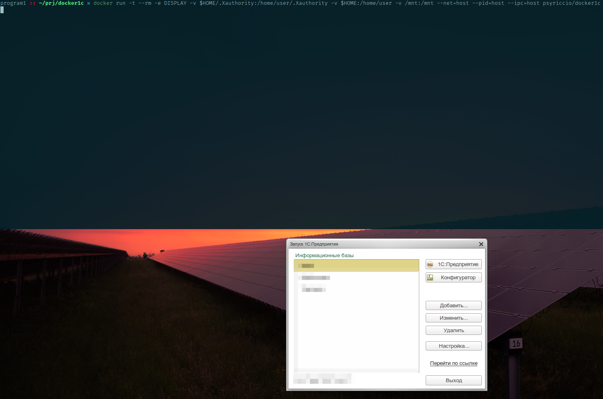
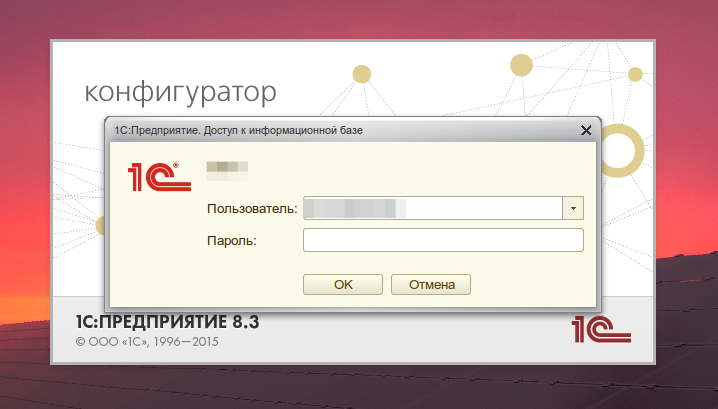

# Docker контейнер для linux 1С клиента

Контейнер на базе ubuntu 14.04, в составе infinality-патчи (рендеринг шрифтов),
шрифт "Fira Code", набор стандартных шрифтов mscorefonts (читайте лицензию в архиве),
набор тем Zukitwo, UltraFlatIcons, YltraIcons
можно не использовать: выкинуть файлы "ultraflat-icons.zip, yltra-icons.zip, zukitwo-themes.zip" ,
и удалить из DockerFile строки:
<blockquote>
  

  && unzip /opt/zukitwo-themes.zip -d /usr/share/themes \  
  && unzip /opt/yltra-icons.zip -d /usr/share/icons \  
  && unzip /opt/ultraflat-icons.zip -d /usr/share/icons \  
  

</blockquote>

### Настройка, сборка и использование

* В Dockerfile исправить версию платформы, архитектуру и используемую кодировку
<blockquote>
  ENV PLT_VERSION 8.3.7-1873  
  ENV PLT_ARCH amd64  
  ENV LANG ru_RU.utf8  
</blockquote>

* Разместить официальные deb-пакеты 1С соответствующих версий и архитектуры (common, server, client) в директории ./dist (server нужен тоже, не знаю зачем, но он указан в зависимостях пакета client (1С -- такая 1С))

Лицензия: [LGPLv3](./LICENSE.TXT)
* Собрать контейнер `docker build -t psyriccio/docker1c .`

* Использовать для запуска `./run.sh` или комманду вида
`docker run -t --rm -e DISPLAY -v $HOME/.Xauthority:/home/user/.Xauthority -v $HOME:/home/user -v /mnt:/mnt --net=host --pid=host --ipc=host psyriccio/docker1c`

